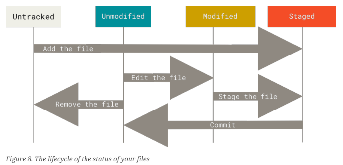

# Github Introduction
This is a introduction into Git. It is intended to be a simple tutorial into Github/Gitlab and its commands. For a more in depth look into git checkout the [Git Book](https://git-scm.com/book/de/v2 ).

## Frequently used Commands

- `git init` to create a git repo
- `git add myFile` to put files in the stage'ing state (prepareing them for the commit)
- `git commit -m "commit message"` to commit all staged files with an apropriate commit message
- `git commit -a -m "commit message"` to add and commit all modified files
- `git clone https://github.com/myproject` to clone a repository
- `git push` to save local changes to remote repository
- `git pull` to load newest version from remote repository
- `git status` to see the status of your files
- `git log` shows the previous commits
- `git checkout mybranch` changes to another branch and with `-b my branch` git creates and switches to that branch
- `git branch` creates a new branch, with `-d` branch gets deleted
- `git merge mybranch` branch wird in master branch integriert

## General idea of Git 

The underlying idea of git is __version control__. Version control is a system that records
changes to a file or set of files over time so that you can recall specific versions later.

## Git Basics on your Local Machine
### Creating a Repository on your local machine

The most basic case for the useage of git would be version control on your local machine. For that there are two ways wich will get you a Git repository (or short repo).

- 1. You turn a local directory into a Git repo or
- 2. You clone (copy) an existing Git repo from elsewhere

In either case, you end up with a Git repository on your local machine, ready for work.

#### Initializing a repository in an existing directory

If you have a project directory that is currently not under version control and you want to start
controlling it with Git, you first need to go to that project’s directory useing the change directory command `cd` in an terminal. If you’ve never done this, it
looks a little different depending on which system you’re running:
- Linux: `$ cd /home/user/my_project`
- MacOS: `$ cd /Users/user/my_project`
- Windows: `$ cd C:/Users/user/my_project`

and then type `$ git init`. This creates a new subdirectory named .git that contains all of your necessary repository files - a
Git repository skeleton. At this point, nothing in your project is tracked yet.

If you want to start version-controlling existing files (as opposed to an empty directory), you should
probably begin tracking those files and do an initial commit. You can accomplish that with a few
`git add` commands that specify the files you want to track, followed by a `git commit`:

- `$ git add myFile.txt` this command adds the file to the files the will be tracked.
- `git commit -m "My first git Commit"` this command commits the file (kind of like saving a file) and adds a message with `-m "..."` to the commit.

The commit message should shortly describe the changes that happend to the files since the last commit. 

#### Cloning an existing Repository

If you want to get a copy of an existing Git repository - for example, a project you’d like to
contribute to - the command you need is ``git clone``. If you’re familiar with other VCSs such as
Subversion, you’ll notice that the command is "clone" and not "checkout". This is an important
distinction — instead of getting just a working copy, Git receives a full copy of nearly all data that
the server has.

- `$ git clone https://github.com/myproject`

If you want to clone the repository into a directory named something other than `myproject`, you can
specify the new directory name as an additional argument:

- `$ git clone https://github.com/myproject newproject` which saves the repo as `newproject`

### Recording Changes to the Repository

At this point, you should have a bona fide Git repository on your local machine, and a checkout or
working copy of all of its files in front of you. Typically, you’ll want to start making changes and
committing snapshots of those changes into your repository each time the project reaches a state
you want to record.

Remember that each file in your working directory can be in one of two states: tracked or
untracked. Tracked files are files that were in the last snapshot, as well as any newly staged files;
they can be unmodified, modified, or staged. In short, tracked files are files that Git knows about.

Untracked files are everything else — any files in your working directory that were not in your last
snapshot and are not in your staging area. When you first clone a repository, all of your files will be
tracked and unmodified because Git just checked them out and you haven’t edited anything.

As you edit files, Git sees them as modified, because you’ve changed them since your last commit.
As you work, you selectively stage these modified files and then commit all those staged changes,
and the cycle repeats.



The main tool you use to determine which files are in which state is the ``git status`` command. If you
run this command directly after a clone, you should see something like this:

``$ git status``

``On branch master``

``Your branch is up-to-date with 'origin/master'.``

``nothing to commit, working tree clean``

This means you have a clean working directory; in other words, none of your tracked files are
modified. Git also doesn’t see any untracked files, or they would be listed here. Finally, the
command tells you which branch you’re on and informs you that it has not diverged from the same
branch on the server. Additionally the `git status` will give you information on how to handle 
certain file at the different stages.

In order to start tracking a new file you will use:
`$ git add newFile`.

To Stage modified Files, which has already been tracked, you also use: 
`$ git add modifiedFile`

Basically if you want a file to be in the stage'ing state you use `git add`. 

After that you want to commit the files, but there is an easier way to add a lot of files and to commit them.

Use `git commit -a -m "my commit message"` to add all modified  (not untracked) files with `-a` and commit them.

Sometimes you don't want Git to show you some files. Then you can create a new file in your directory called `.gitignore`.
In each line of this file ther should be some kind of filename, which you want git to ignore. There are a few shortcuts for 
files with the same ending, but for that checkout the Git Book on page 32.

## Branching

With every commit Git saves a snapshot of your files. All the previous commits (or with other words the history of the files) represent 
a branch. The default branch is called __master__ or __main__. Either for fixing issues with the code, or to work simultaniously with 
other developers it might be the best way to create different branches, which don't actually influence the __main__ branch. 

## Git remote Repository


## Git Help:
```
These are common Git commands used in various situations:

start a working area (see also: git help tutorial)
   clone     Clone a repository into a new directory
   init      Create an empty Git repository or reinitialize an existing one

work on the current change (see also: git help everyday)
   add       Add file contents to the index
   mv        Move or rename a file, a directory, or a symlink
   restore   Restore working tree files
   rm        Remove files from the working tree and from the index

examine the history and state (see also: git help revisions)
   bisect    Use binary search to find the commit that introduced a bug
   diff      Show changes between commits, commit and working tree, etc
   grep      Print lines matching a pattern
   log       Show commit logs
   show      Show various types of objects
   status    Show the working tree status

grow, mark and tweak your common history
   branch    List, create, or delete branches
   commit    Record changes to the repository
   merge     Join two or more development histories together
   rebase    Reapply commits on top of another base tip
   reset     Reset current HEAD to the specified state
   switch    Switch branches
   tag       Create, list, delete or verify a tag object signed with GPG

collaborate (see also: git help workflows)
   fetch     Download objects and refs from another repository
   pull      Fetch from and integrate with another repository or a local branch
   push      Update remote refs along with associated objects

'git help -a' and 'git help -g' list available subcommands and some
concept guides. See 'git help <command>' or 'git help <concept>'
to read about a specific subcommand or concept.
See 'git help git' for an overview of the system.
```